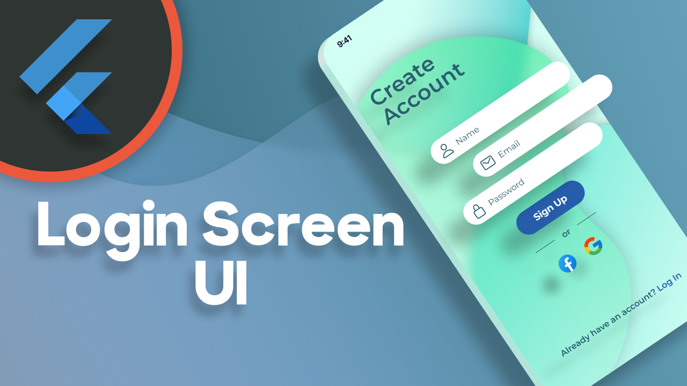

# Login Screen UI

This project is all about designing a Login Screen with a modern UI using the latest features offered by Flutter. In a total of three parts we will create a unique background using Glassmorphism, design appealing input fields for the best user experience and include eye-caching animations for a smooth feeling.

---

☕️ Creating these videos requires a lot of time and effort. If you enjoy my content you can buy me a coffee so I can produce more videos during the night:

[**Support DebugErrorX**](https://www.buymeacoffee.com/debugerrorx)

Thank you!

---

## [Watch it on YouTube](https://www.youtube.com/playlist?list=PLz3ulyTHbIEcUKeDqTAMPDsNu3VERlwm9)

 

---

You want more Flutter content? Check out my YouTube channel [**DebugErrorX**](https://www.youtube.com/channel/UCtY6vtwLqivmnquY1fg-BkQ)
- [Recent Flutter Videos](https://www.youtube.com/channel/UCtY6vtwLqivmnquY1fg-BkQ/videos)
- [Subscribe to DebugErrorX](https://www.youtube.com/channel/UCtY6vtwLqivmnquY1fg-BkQ?sub_confirmation=1)
